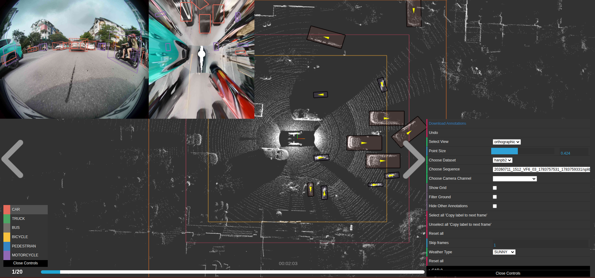
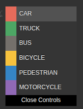
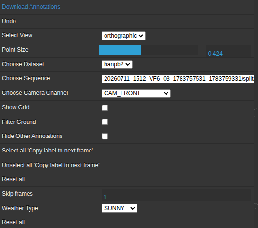
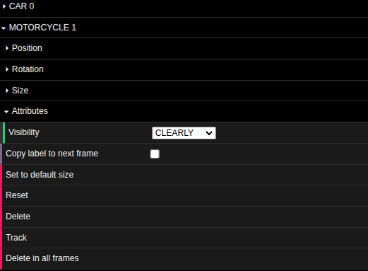
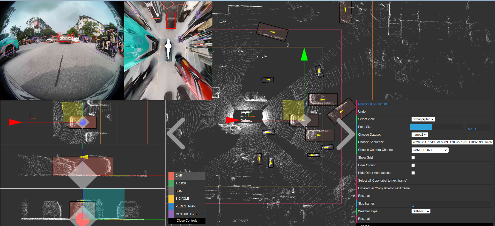

# Hướng dẫn dán nhãn dành cho Annotator — Công cụ dán nhãn 3D (3D Annotation Tool)

## Bắt đầu

1. Chọn **Bộ dữ liệu (Dataset)**, **Phân đoạn (Sequence)**, và **Kênh camera (Camera Channel)** từ các menu thả xuống ở góc trên bên phải.
2. Màn hình chính hiển thị đám mây điểm 3D (3D point cloud). Ảnh camera thuộc kênh đã chọn và góc nhìn từ trên xuống (Bird's Eye View - BEV) sẽ xuất hiện ở mép trên bên trái màn hình.
3. Chuyển đổi giữa các khung hình (frames) bằng nút **◀ / ▶** hoặc phím `P` / `N`. Bộ đếm khung hình (ví dụ: `4/150`) nằm ở phía dưới cùng.
4. Nhấn `F` bất kỳ lúc nào để mở bảng thông tin khung hình — tiện lợi cho việc kiểm tra thông tin file ảnh/nhãn/lidar bạn đang thực hiện.

## Tạo khung 3D (Box)

1. Chọn lớp đối tượng (object class) từ bảng chọn class bên trái, hoặc nhấn các phím từ `0` đến `9`.

2. Tại màn hình **Bird's Eye View (BEV)** hoặc cửa sổ 3D, giữ phím `Ctrl` và kéo rê chuột qua đối tượng trên mặt đất để vẽ khung.
3. Một khung mới sẽ xuất hiện với kích thước mặc định của class đó — hãy điều chỉnh lại cho khớp với vị trí đối tượng.

## Chọn và điều chỉnh khung

**Chọn khung đối tượng:** Nhấp chuột trái vào khung đối tượng trong góc nhìn 3D, hoặc dùng phím `Tab` / `Shift+Tab` để di chuyển qua lại giữa các khung trong cùng một frame.
- Sau khi được chọn, các góc nhìn cận cảnh Từ bên cạnh (Side) / Từ phía trước (Front) / Từ trên xuống (BEV) sẽ hiện ra để hỗ trợ điều chỉnh chi tiết.
**Chuyển đổi chế độ điều chỉnh:**
  - `Alt` + `T` → Di chuyển (Translate)
  - `Alt` + `R` → Xoay (Rotate)
  - `Alt` + `S` → Thu phóng / Thay đổi kích thước (Scale)
**Điều chỉnh bằng bàn phím** (trong chế độ Translate): Dùng `W`/`A`/`S`/`D` để di chuyển, `Q`/`E` để di chuyển theo trục thứ ba (trục cao độ).
- Giữ `Ctrl` trong khi kéo các tay cầm (gizmo handle) để căn chỉnh theo các nấc 0.5m đối với vị trí / 15° đối với góc xoay.

## Panel
Khung hình góc phải màn hình bao gồm frame's panel và box panels.

| Frame's panel | Box's panel |
|---|---|
| | |

## Thuộc tính (Attributes)

- Chọn **Loại thời tiết (Weather Type)** cho khung hình từ menu thả xuống ở frame's panel — thuộc tính này áp dụng cho toàn bộ frame.
- Mở thư mục của khung ở box's panel để thiết lập **Độ hiển thị (Visibility)** và các thuộc tính riêng khác của từng class.

## Sao chép nhãn qua các khung hình

- Đánh dấu chọn **"Copy label to next frame"** (Sao chép nhãn sang frame tiếp theo) trên box's panel trước khi chuyển sang frame mới để tự động chuyển nhãn đó tiếp nối về sau.
- Sử dụng tùy chọn **"Select all / Unselect all copy label to next frame"** ở frame's panel để áp dụng tính năng này cho tất cả các khung cùng một lúc.

## Xóa

- Phím `Delete` / `Backspace`, hoặc giữ `Ctrl` + nhấp chuột phải vào khung: Xóa khung đó duy nhất tại frame hiện tại.
- Tùy chọn "Delete in all frames" (trong box's panel): Xóa đối tượng đang theo vết đó trên tất cả các frame.

## Hoàn tác & Lưu dữ liệu

- `Ctrl` + `Z`: Hoàn tác (Undo) thao tác vừa thực hiện (áp dụng cho việc xóa, di chuyển, xoay, thu phóng, thay đổi Track ID, chuyển frame).
- Công cụ sẽ **tự động lưu frame hiện tại mỗi 5 giây** và mỗi khi bạn chuyển đổi frame/sequence/dataset — bạn không cần lưu thủ công, nhưng không tắt tab trình duyệt giữa chừng khi đang chỉnh sửa dở dang trên một frame.

## Bảng phím tắt nhanh

| Phím | Thao tác |
| --- | --- |
| `N` / `P` | Frame tiếp theo / Frame trước đó|
| `Tab` / `Shift+Tab` | Đối tượng tiếp theo / Đối tượng trước đó|
| `0`–`9` | Chọn class|
| `Alt+T` / `Alt+R` / `Alt+S` | Chế độ Di chuyển / Xoay / Thu phóng|
| `Space` | Phát/Dừng phân đoạn (khi không chọn khung nào)|
| `Ctrl`+kéo chuột (BEV) | Vẽ khung mới|
| `Delete` | Xóa khung đang chọn|
| `Ctrl+Z` | Hoàn tác (Undo)|
| `C` | Chuyển đổi giữa góc nhìn orthographic (chính diện/vuông góc) và perspective (phối cảnh)|
| `F` | Bật/tắt bảng thông tin frame|
| `Esc` | Bỏ chọn đối tượng|

**Khi nhìn không rõ đối tượng:** Chọn đối tượng, kiểm tra xem các góc nhìn cận cảnh từ Side/Front/BEV đã khớp với đám mây điểm chưa, và xác nhận lại class cùng các thuộc tính đã chính xác trước khi chuyển sang frame tiếp theo.

